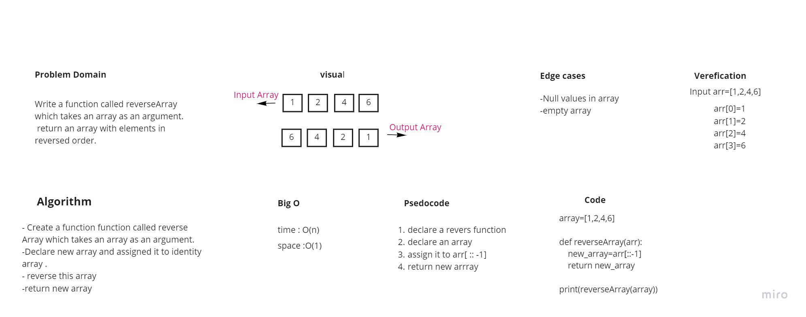

# Reverse an Array

## function that takes array and returns the array elements in reversed order

## Whiteboard Process

## Approach & Efficiency
The Approach I take:
create new array to reverse the order to it it has linear time complexity and constant space complexity

The Big O space/time for this approach:
Time= O(n)
space=O(1)

