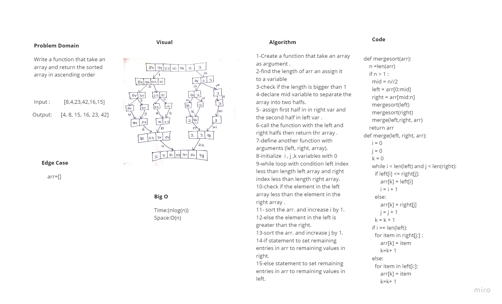

# Challenge Summary

merge sort function that sort an array ascendingly.

## Whiteboard Process

## Approach & Efficiency

time O(nlog(n))
space O(n)

## Solution

merge sort function that take an array and return the array with ascendining order .
