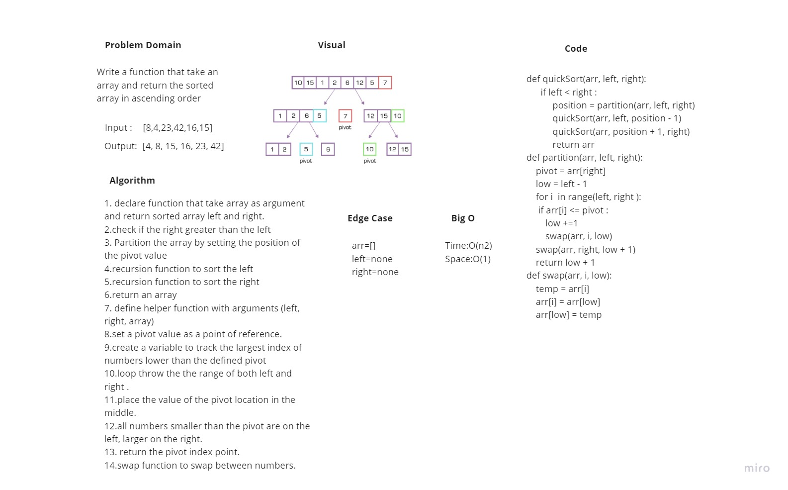

# Challenge Summary

Write a function that sort an array ascendingly using quick sort.

## Whiteboard Process

## Approach & Efficiency

time O(n2)
space O(1)

## Solution
 quick sort function that take an array and return the array with ascendining order
