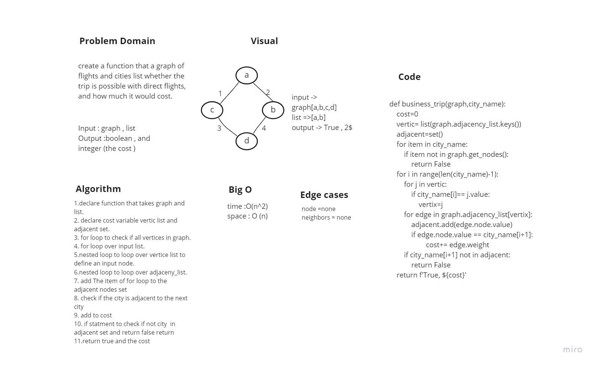

# Challenge Summary

function that a graph of flights and cities list whether the trip is possible with direct flights, and how much it would cost.

## Whiteboard Process

## Approach & Efficiency

- time :O(n^2)
- space : O (n)

## Solution

- function that return if a trip is possible between citities and return the cost
