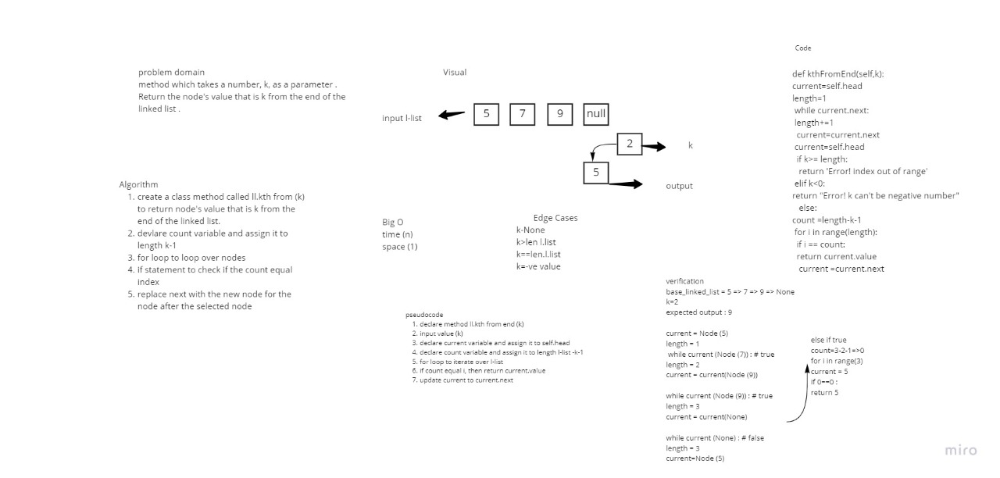

# Challenge Summary

to build linked list data structure do kthFromEnd method to linked list data structure

Whiteboard Process

## Whiteboard Process

## Approach & Efficiency
Approach & Efficiency was choosen to be big O for time and space:

kthFromEnd: time O(n) space O(1)

## Solution
kthFromEnd takes a argument k and return the node’s value that is k from the end of the linked list
