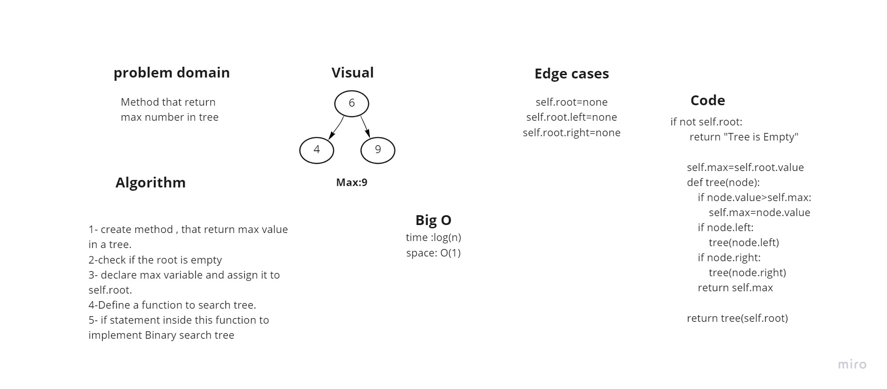

## Challenge 16

* build Binary_Tree class Define a method for each of the depth first traversals:
And find the max value of nodes

## White board :

## Approach & Efficiency

max: time O(n)

 space O(1)

## API

max: method that return max value in tree
